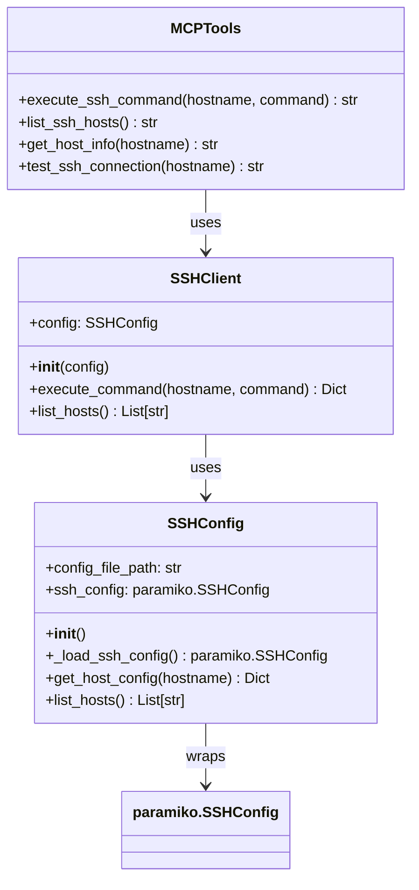
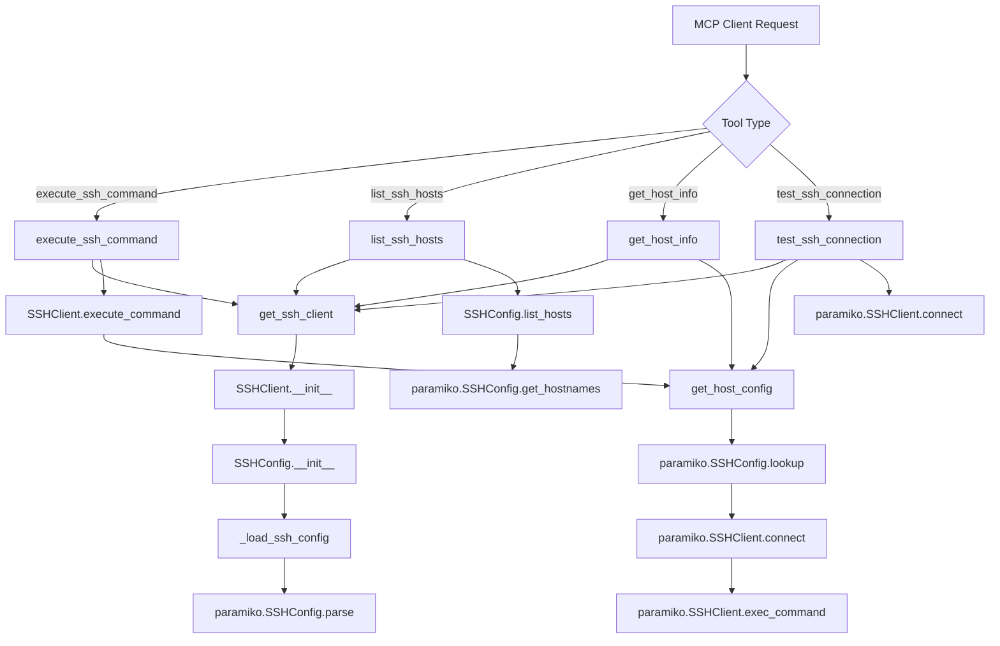

# SSH MCP: Model Context Protocol tool for Virtual Machine Management over SSH

SSH MCP is a Model Context Protocol tool written in Python for managing and interacting with multiple virtual machines (VMs) over SSH. It simplifies executing commands on remote servers by using the standard SSH config file format and leverages the robust `paramiko` library to handle SSH connections and command execution securely and efficiently.

-----

## Key Features 🚀

- **Standard SSH Config**: Uses the familiar `~/.ssh/config` file format for managing VM connection details
- **Automatic Key Management**: Uses SSH keys specified in the config file for each host
- **Remote Command Execution**: Execute terminal commands on any configured VM directly from your local machine
- **MCP Integration**: Provides tools for AI assistants through the Model Context Protocol
- **Simplified Workflow**: Streamline your server administration tasks using standard SSH configuration

-----

## Requirements 📋

To use SSH MCP, you'll need the following on your system:

- **Python 3.12 or higher**: Ensure you have a recent version of Python installed.
- **paramiko**: The core Python library for the SSHv2 protocol.
- **fastmcp**: For MCP server functionality.

-----

## Installation 💻

1. **Clone the Repository**: Start by cloning the SSH MCP repository to your local machine
2. **Install Dependencies**: Install the necessary Python libraries `uv sync`

-----

## Configuration ⚙️

SSH MCP uses the standard SSH configuration file format. By default, it looks for `~/.ssh/config`, but you can specify a custom path using the `SSH_CONFIG_PATH` environment variable.

### SSH Config File Setup

Create or update your `~/.ssh/config` file with your server details:

**Example `~/.ssh/config`:**

```config
Host web-server-01
    HostName 192.168.1.101
    Port 22
    User admin
    IdentityFile ~/.ssh/id_rsa

Host db-server-01
    HostName 192.168.1.102
    Port 22
    User dba
    IdentityFile ~/.ssh/id_rsa

Host app-server-01
    HostName 192.168.1.103
    Port 2222
    User deployer
    IdentityFile ~/.ssh/id_ed25519
```

### Environment Variables (Optional)

- `SSH_CONFIG_PATH`: Path to SSH config file (defaults to `~/.ssh/config`)

-----

## Usage Guide 📖

SSH MCP can be used in two ways: as a direct command-line tool or as an MCP (Model Context Protocol) server.

### Direct Command-Line Usage

You can execute commands directly using the command line interface:

**Basic Command Execution**:

```bash
python cli.py <host> "<command_to_execute>"
```

**Examples**:

To list the files in the home directory of `web-server-01`:

```bash
python cli.py web-server-01 "ls -l /home/admin"
```

To check the disk space on `db-server-01`:

```bash
python cli.py db-server-01 "df -h"
```

### MCP Server Usage

SSH MCP can also run as an MCP server, providing tools that can be used by AI assistants and other MCP clients:

```bash
python main.py
```

**Available MCP Tools:**

1. **execute_ssh_command**: Execute a command on a remote host
   - Parameters: `hostname` (string), `command` (string)

2. **list_ssh_hosts**: List all configured SSH hosts
   - Parameters: None

3. **get_host_info**: Get detailed information about a specific host
   - Parameters: `hostname` (string)

4. **test_ssh_connection**: Test SSH connection to a host
   - Parameters: `hostname` (string)

-----

## Architecture & Workflow 🏗️

SSH MCP follows a clean architecture with clear separation between configuration management, SSH operations, and MCP integration.

### Class Structure



### Workflow Diagram



-----

## Development & Testing 🧪

SSH MCP uses a focused testing approach that emphasizes real integration tests over complex mocked unit tests.

### Test Structure

- **`tests/test_ssh_client.py`**: Basic unit tests for core functionality
- **`tests/test_mcp.py`**: Minimal MCP tool tests with simple mocking
- **`tests/test_integration.py`**: Real integration tests that connect to actual SSH hosts

### Integration Testing

The integration tests require a host named `test` in your SSH config. Add a host like this to `~/.ssh/config`:

```config
Host test
    HostName your-test-server.com
    User your-username
    IdentityFile ~/.ssh/your-key
```

The integration tests will:

- Connect to the real SSH host
- Execute actual Linux commands
- Test the full MCP workflow end-to-end

### Running Tests

```bash
# Run all tests
uv run pytest tests/ -v

# Run only integration tests (requires 'test' host)
uv run pytest tests/test_integration.py -v

# Run only unit tests
uv run pytest tests/test_ssh_client.py tests/test_mcp.py -v

# Run with coverage
uv run pytest tests/ --cov=ssh_mcp --cov-report=html

### Code Quality

The project uses `ruff` for linting and formatting:

```bash
# Check code quality
uv run ruff check .

# Format code
uv run ruff format .
```
